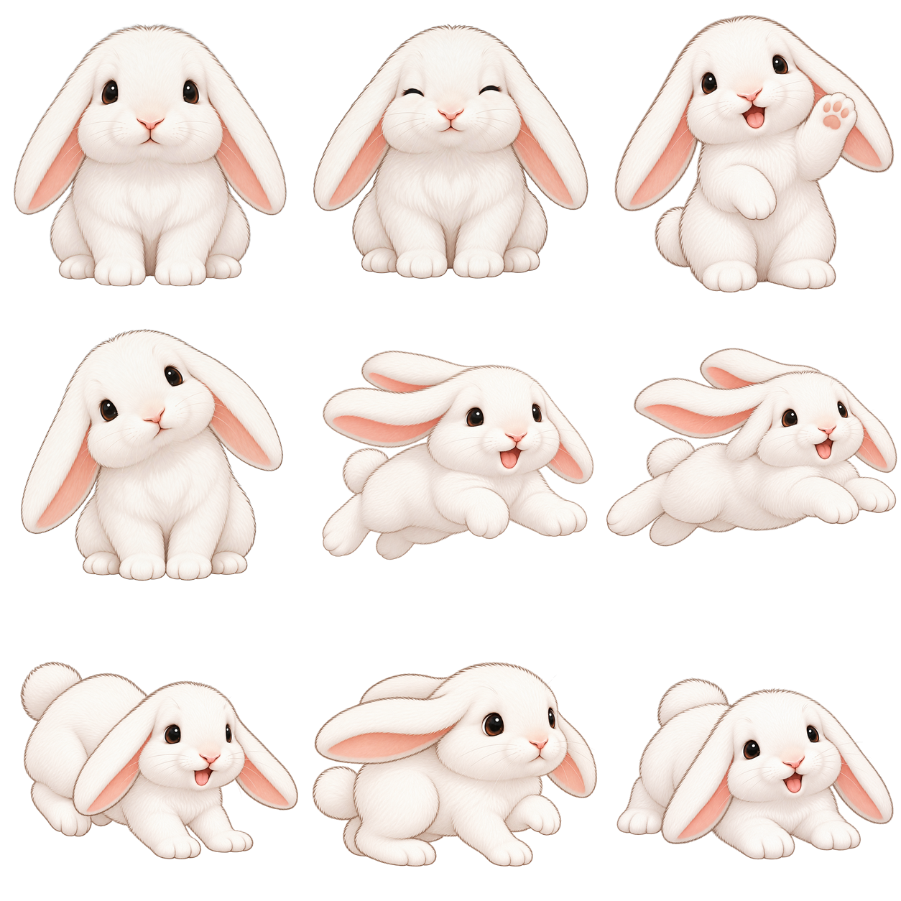

# Cute Desktop Pet 🐾

แอปตัวการ์ตูนตัวเล็กสำหรับ Windows ที่เดินเล่นบนหน้าจอระหว่างทำงาน เปิดมาจะพบ **BooBoo** กระต่ายหูตกสีขาว และยังเลือกผู้พิทักษ์ดวงดาว ยานสำรวจ ตัวละครผจญภัย 4 แบบ และแมวได้ BooBoo เคลื่อนไหวอย่างเดียวโดยไม่ยิงพลัง ส่วนตัวละครอื่นยังใช้พลังของตนเองได้ แอปใช้ Tkinter และภาพ PNG โปร่งใสที่อยู่ใน repository จึงไม่ต้องเปิดเซิร์ฟเวอร์หรือจ่ายรายเดือน

BooBoo มี **9 ท่า** ในสไตล์ภาพต้นแบบ: นั่งเฉย ๆ ยิ้มหลับตา ดีใจ เอียงหัว เตรียมกระโดด ลอยตัว ลงพื้น ยืดตัว และนอนพัก ท่าลอยตัวมองด้านข้างจึงเห็นหูเพียงข้างเดียว ภาพทั้งหมดมีพื้นหลังโปร่งใสจริง แอปสลับภาพตามจังหวะกระโดด กะพริบตา หันซ้าย–ขวา และหยุดพัก โดยไม่ต้องลงไลบรารีภาพเพิ่ม ขอบภาพที่แสดงบน Windows ใช้อัลฟาแบบคมเพื่อป้องกันเส้นสีม่วงจากสีโปร่งใสของหน้าต่าง

ผู้พิทักษ์และยานเป็นตัวละครต้นฉบับของโปรเจกต์ ใช้บรรยากาศผจญภัยในอวกาศโดยไม่ใช้ชื่อ โลโก้ เครื่องแต่งกาย หรือรูปทรงยานจากแฟรนไชส์ภาพยนตร์

นักดูแลพฤกษา พ่อมด นักสำรวจเส้นทาง และผู้พิทักษ์แสงอำพันเป็นตัวละครที่วาดขึ้นใหม่สำหรับแอป ใช้ภาพอ้างอิงเพื่อกำหนดแนวแฟนตาซี แต่ปรับรูปทรง สี และอุปกรณ์ให้มีเอกลักษณ์ของตัวเอง

## ตัวละครทั้งหมด

| | |
|:---:|:---:|
|  **ผู้พิทักษ์ดวงดาว** |  **ยานสำรวจดาว** |
|  **นักดูแลพฤกษา** |  **พ่อมด** |
|  **นักสำรวจเส้นทาง** |  **ผู้พิทักษ์แสงอำพัน** |
|  **แมวน้อย** |  **BooBoo กระต่ายหูตก** |

## พลังของตัวละคร

ตัวละครอีก 7 ตัวปล่อยพลังที่มีสีและรูปร่างต่างกัน ส่วน **BooBoo ไม่ยิงพลัง** หลังแสดงท่าพลังแล้ว **เอฟเฟกต์จะค้างให้เห็นอีกประมาณ 4 วินาที** รวมถึงพลังที่เคลื่อนถึงขอบจอ ก่อนหายไปเอง ไม่มีเสียงหรือการโต้ตอบกับแอปอื่น พ่อมดยิงแสงจากปลายไม้เท้าได้

| ตัวละคร | พลังพิเศษ |
|:---|:---|
| พ่อมด | เสกทอร์นาโดหมุนเคลื่อนที่ |
| นักดูแลพฤกษา | เสกต้นไม้ให้ค่อย ๆ เติบโต |
| ผู้พิทักษ์แสงอำพัน | พ่นไฟไปตามทิศที่เดิน |
| ผู้พิทักษ์ดวงดาว | เรียกฟ้าผ่าลงข้างตัว |

- **คลิกขวา → ยิงพลัง** หรือ **Ctrl+คลิกซ้าย** บนตัวละครอื่นเพื่อยิงทันที (กด **F** ได้เมื่อหน้าต่างตัวละครรับคีย์บอร์ด) คำสั่งยิงถูกปิดเมื่อเลือก BooBoo
- เมื่อเลือกหนึ่งในสี่ตัวละครข้างต้น ใช้ **คลิกขวา → ชื่อพลังพิเศษ** หรือกด **T** เพื่อใช้พลังพิเศษของตัวนั้น
- ตัวละครอีก 7 ตัวใช้พลังของตัวเองอัตโนมัติ **ทุก 5 วินาที** ตามค่าเริ่มต้น เปลี่ยนเป็น **ทุก 3 หรือ 6 วินาที** ได้ที่ **คลิกขวา → ความถี่ใช้พลัง** ตัวละครที่มีพลังพิเศษ 4 ตัวจะใช้พลังพิเศษ ส่วนตัวอื่นใช้พลังยิงประจำตัว
- ปิดการใช้พลังอัตโนมัติได้ด้วย **คลิกขวา → ใช้พลังอัตโนมัติ** การยิงด้วยมือไม่เลื่อนรอบยิงอัตโนมัติ

## เริ่มใช้งาน

ต้องมี Windows 10/11 และ Python 3.10 ขึ้นไปพร้อม Tkinter (เลือกติดตั้ง Python รุ่นปกติจาก python.org) ไฟล์ `run.bat` จะเลือก Python ที่เปิด Tkinter ได้เอง หากในเครื่องมี Python หลายตัว

1. ดาวน์โหลด repository นี้เป็น ZIP แล้วแตกไฟล์ หรือใช้ `git clone`
2. ดับเบิลคลิก `run.bat`

## วิธีเล่น

- **ผู้พิทักษ์ดวงดาว** และ **ตัวละครผจญภัยทั้ง 4 แบบ** เดินซ้าย–ขวาและกระโดดขึ้น–ลงเองเป็นช่วง ๆ กดปุ่มกลางที่ตัวละครหรือเลือก **กระโดด** ในเมนูคลิกขวาเพื่อสั่งกระโดดทันที
- **ยานสำรวจดาว** บินทั้งแนวนอนและแนวตั้ง เด้งกลับเมื่อชนขอบพื้นที่หน้าจอ
- แมวเดินและหยุดพัก ส่วน **BooBoo** เดินด้วยจังหวะกระโดดสั้น ๆ ผ่านท่าเตรียม ลอยตัว และลงพื้น หยุดเอียงหัว ยืดตัว นอนพัก ยิ้ม และกะพริบตา; ดับเบิลคลิกเพื่อให้นอนพักต่อเนื่อง
- **ลากด้วยปุ่มซ้าย** เพื่อย้ายตำแหน่ง ตัวละครจะเดินหรือบินต่อจากจุดที่วาง
- **ดับเบิลคลิก** เพื่อหยุดหรือเดินต่อ
- **คลิกขวา** เพื่อเปลี่ยนตัวละคร ความเร็ว หยุดการเคลื่อนที่ ย้ายกลับขอบล่าง หรือออกจากแอป
- พื้นที่ว่างรอบตัวการ์ตูนโปร่งใส จึงไม่บังหน้าต่างที่กำลังทำงานอยู่

แอปจะอยู่เหนือหน้าต่างอื่นตามค่าเริ่มต้น ปิดการตั้งค่านี้ได้จากเมนูคลิกขวา หากต้องการปิดแอปให้เลือก **ออกจากแอป** ในเมนูนั้น

