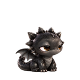
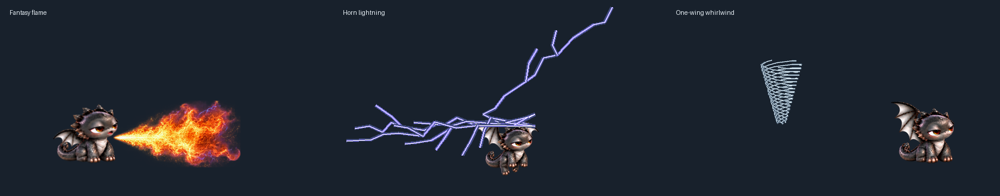
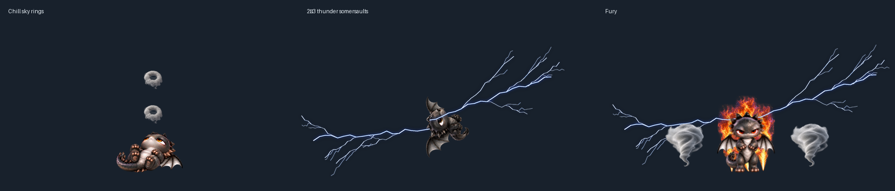
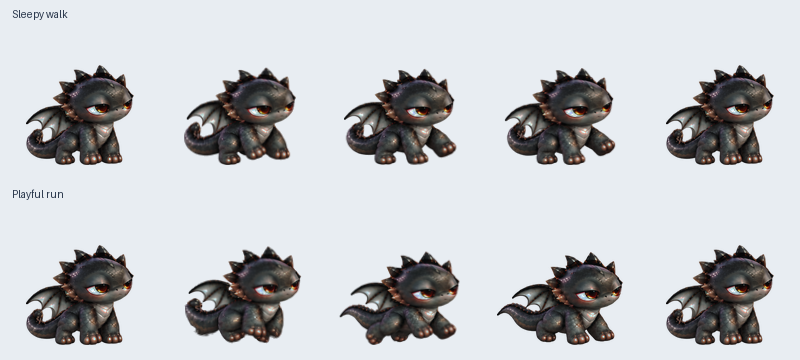
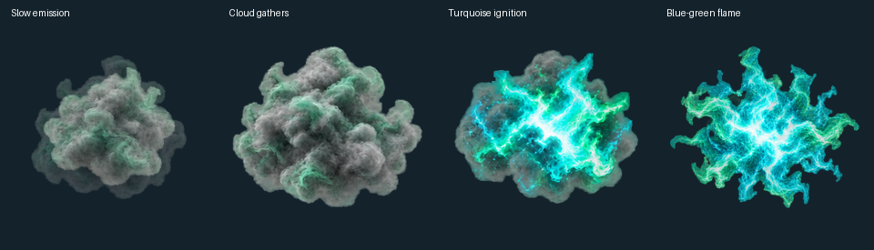
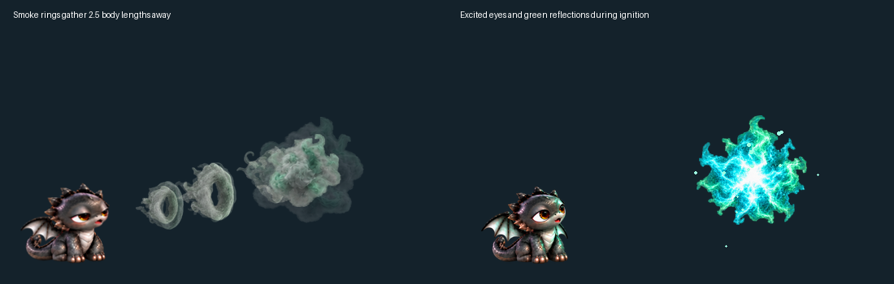

# Cute Desktop Pet

A rabbit, a puppy, a bald eagle, and a fluffy tabby kitten live on your desktop. Each has 195 animation frames, long walks and naps, and its own grooming, sniffing, stretching or playful gestures. Ground pets occasionally run; the eagle flies across and up the screen before landing. Seven other characters are available from the menu.

The black dragon has 1,110 body frames: sleepy gestures, warning displays, roars, large fantasy flame breath, smoke rings, rapid tree-like lightning branching sideways from its horns, and a seated one-wing whirlwind made of volumetric cloud wisps. Jade-grey smoke rings drift out and merge into a gas cloud about 2.5 dragon body lengths away. The cloud holds briefly, then ignites into turquoise-green flames and falling embers; the consumed gas disappears completely. The dragon widens its eyes and lifts its head and wings in excitement, with green light reflected on its dark scales during ignition. Fire and smoke occur more often, with cooldowns to vary the routine. Large effects use a separate transparent layer so the face stays intact. It now takes slow ground walks lasting 18–30 seconds and occasional short 5–8 second runs, with distance-driven paw cycles and painted sitting transitions. The dragon can soar high across the screen for 25–45 seconds. Each flight has a 50% chance of 2–3 thunder somersaults. It can also relax belly-up for 22–28 seconds and blow smoke rings that linger for six seconds into the sky, or stand on two hind feet with red eyes, continuous wingbeats, flame aura, lightning and wind vortices.

Named behaviors, recent activity memory, and cooldowns vary the routine. Painted waking, stretching, and turning clips connect rest and travel. Pause and dragging freeze the behavior clock.

| Rabbit | Puppy | Bald Eagle | Tabby Kitten |
| :---: | :---: | :---: | :---: |
|  |  |  |  |

| Sleepy Dragon |
| :---: |
|  |

New dragon behaviors are currently available from source on **main**; release downloads will be updated in a later release.

## Download

Choose a ZIP from the [latest release](https://github.com/panithan1991/cute-desktop-pet/releases/latest):

| Download for Window | Download for MAC |
| --- | --- |
| [Windows 10/11 ZIP](https://github.com/panithan1991/cute-desktop-pet/releases/latest/download/CuteDesktopPet-Windows.zip) | [Apple Silicon ZIP](https://github.com/panithan1991/cute-desktop-pet/releases/latest/download/CuteDesktopPet-macOS-Apple-Silicon.zip) · [Intel ZIP](https://github.com/panithan1991/cute-desktop-pet/releases/latest/download/CuteDesktopPet-macOS-Intel.zip) |

Extract the ZIP. On Windows, open one of the included pet executables. On Mac, open the included app and choose a character from the pet menu. The downloads include Python, Tk, and the artwork. Right-click the pet (or Control-click on Mac) to switch characters, trigger a playful roll, pause, or quit. Drag it to move it.

Choose **Dragon Behaviors** to try **Walk / Run**, **Jade Cloud Ignition**, flame breath, smoke rings, warning displays, roars, horn lightning a wing whirlwind, belly-up smoke rings or fury. The dragon also selects these activities automatically with cooldowns.

Every release ZIP has a [SHA-256 checksum](https://github.com/panithan1991/cute-desktop-pet/releases/latest/download/SHA256SUMS.txt) and a GitHub build attestation. Compare `Get-FileHash FILE.zip -Algorithm SHA256` (Windows) or `shasum -a 256 FILE.zip` (Mac) with the checksum file. To confirm the build came from this repository, run `gh attestation verify FILE.zip -R panithan1991/cute-desktop-pet` with the [GitHub CLI](https://cli.github.com/).

These checks do not replace OS publisher verification. Windows may warn about the unsigned executables. The Mac app is not Apple-notarized; if macOS blocks its first launch, open **System Settings → Privacy & Security → Open Anyway**. If it still does not appear, check the app startup log under `~/Library/Logs/`.

## Run from source

Install Python 3.10+ with Tkinter, then run `run.bat` on Windows or `run.command` on Mac. No third-party Python packages are needed at runtime.

To build the downloadable apps, install `pyinstaller==6.22.3` and `Pillow>=10,<13`, then run `scripts/build_windows.bat` on Windows or `sh scripts/build_macos.sh` on Mac. Run `python -m unittest discover -s tests -q` to check the code and sprite atlases.
