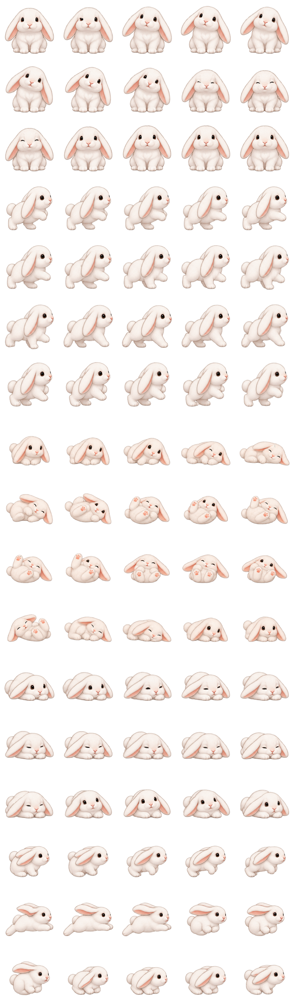
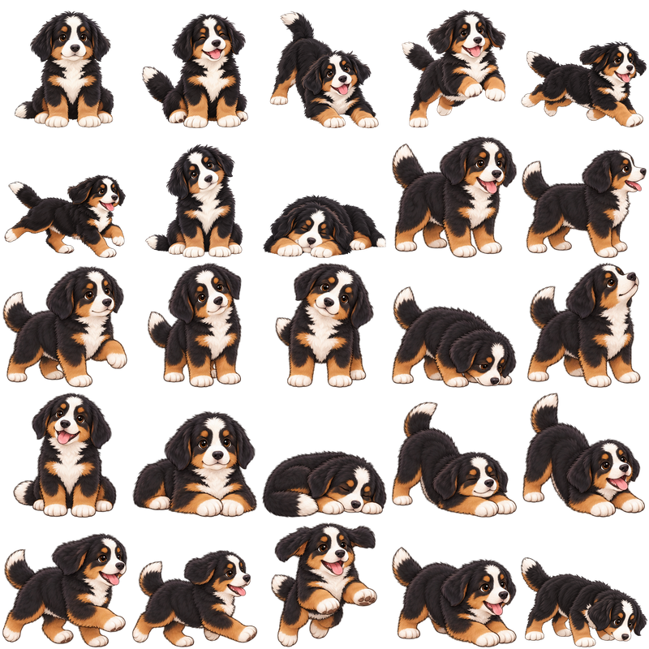
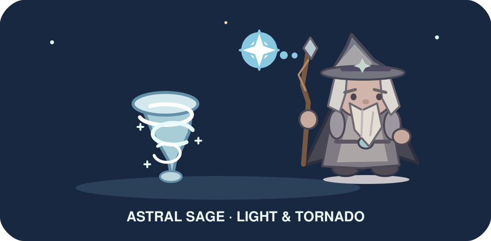
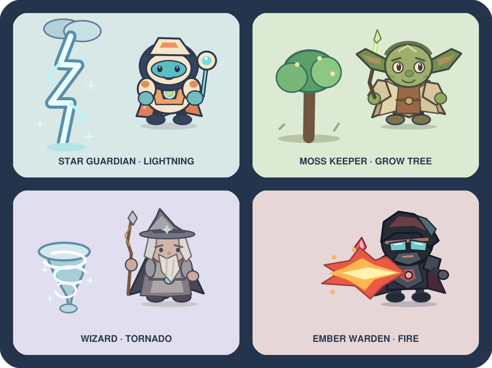

# Cute Desktop Pet 🐾

แอปตัวการ์ตูนตัวเล็กสำหรับ Windows และ macOS ที่เดินเล่นบนหน้าจอระหว่างทำงาน เปิดมาจะพบ **BooBoo** กระต่ายหูตกสีขาว และเลือก **Moo Krata** ลูกสุนัขขนฟูได้ด้วย ทั้งสองตัวมีภาพเคลื่อนไหวคนละ **25 ท่า** เช่น พัก เอียงหัว ดมพื้น วิ่ง กระโดด และเล่น นอกจากนี้ยังมีผู้พิทักษ์ดวงดาว ยานสำรวจ ตัวละครผจญภัย 4 แบบ และแมว BooBoo กับ Moo Krata ไม่ยิงพลัง ส่วนตัวละครอื่นยังใช้พลังของตนเองได้

## ดาวน์โหลดแอปสำหรับ Windows และ Mac

เปิดหน้า [Releases](https://github.com/panithan1991/cute-desktop-pet/releases/latest) แล้วเลือกไฟล์ที่ตรงกับเครื่อง:

- **Windows 10/11:** `CuteDesktopPet-Windows.zip` แตก ZIP แล้วเปิด `BooBoo.exe` หรือ `MooKrata.exe`
- **Mac ชิป M:** `CuteDesktopPet-macOS-Apple-Silicon.zip` แตก ZIP แล้วเปิด `BooBoo.app`
- **Mac ชิป Intel:** `CuteDesktopPet-macOS-Intel.zip` แตก ZIP แล้วเปิด `BooBoo.app`

ไฟล์ดาวน์โหลดรวม Python, Tk และภาพทั้งหมดไว้แล้ว **ไม่ต้องติดตั้ง Python หรือใช้ Terminal** คลิกขวาที่ตัวละครเพื่อเปลี่ยนระหว่าง BooBoo, Moo Krata และตัวอื่น ๆ

แอปเวอร์ชันฟรีนี้ยังไม่ได้ลงนามและรับรองโดย Apple หาก macOS บล็อกครั้งแรก ให้ไปที่ **System Settings → Privacy & Security → Open Anyway** แล้วยืนยัน **Open** ตาม[คำแนะนำของ Apple](https://support.apple.com/guide/mac-help/open-a-mac-app-from-an-unknown-developer-mh40616/mac) ครั้งถัดไปเปิดตามปกติได้

หากดับเบิลคลิกแล้วไม่เห็น BooBoo ให้ตรวจว่าดาวน์โหลด ZIP จากหน้า **Releases** ที่ตรงกับชิป Mac (ไม่ใช่ **Code → Download ZIP**) และเปิด `BooBoo.app` จากโฟลเดอร์ที่แตกไฟล์แล้ว ลอง **Control+คลิก `BooBoo.app` → Open** หนึ่งครั้ง หากยังไม่ขึ้น ให้ดูข้อความใน `~/Library/Logs/BooBoo/startup.log` (ถ้ามี) แล้วแจ้งรุ่น macOS ชิป Mac และข้อความผิดพลาดนั้น เพื่อให้ตรวจสาเหตุบนเครื่องได้

ทดลองดูการเคลื่อนไหวในเว็บได้จาก [index.html](index.html) โดยเปิดไฟล์ในเบราว์เซอร์ ตัวจริงที่เดินบนหน้าจอเดสก์ท็อปให้ใช้ไฟล์ดาวน์โหลดด้านบน

| BooBoo | Moo Krata |
|:---:|:---:|
|  |  |






## ตัวละครทั้งหมด

| | |
|:---:|:---:|
| <br>**ผู้พิทักษ์ดวงดาว** | <br>**ยานสำรวจดาว** |
| <br>**นักดูแลพฤกษา** | <br>**พ่อมด** |
| <br>**นักสำรวจเส้นทาง** | <br>**ผู้พิทักษ์แสงอำพัน** |
| <br>**แมวน้อย** | <br>**BooBoo กระต่ายหูตก** |
| <br>**Moo Krata** | |

## พลังของตัวละคร



| ตัวละคร | พลังพิเศษ |
|:---|:---|
| พ่อมด | เสกทอร์นาโดหมุนเคลื่อนที่ |
| นักดูแลพฤกษา | เสกต้นไม้ให้ค่อย ๆ เติบโต |
| ผู้พิทักษ์แสงอำพัน | พ่นไฟไปตามทิศที่เดิน |
| ผู้พิทักษ์ดวงดาว | เรียกฟ้าผ่าลงข้างตัว |



- **คลิกขวา → ยิงพลัง** บนตัวละครอื่นเพื่อยิงทันที (บน Windows ใช้ **Ctrl+คลิกซ้าย** หรือกด **F** ได้ด้วยเมื่อหน้าต่างตัวละครรับคีย์บอร์ด) คำสั่งยิงถูกปิดเมื่อเลือก BooBoo หรือ Moo Krata
- เมื่อเลือกหนึ่งในสี่ตัวละครข้างต้น ใช้ **คลิกขวา → ชื่อพลังพิเศษ** หรือกด **T** เพื่อใช้พลังพิเศษของตัวนั้น
- ตัวละครอีก 7 ตัวใช้พลังของตัวเองอัตโนมัติ **ทุก 5 วินาที** ตามค่าเริ่มต้น เปลี่ยนเป็น **ทุก 3 หรือ 6 วินาที** ได้ที่ **คลิกขวา → ความถี่ใช้พลัง** ตัวละครที่มีพลังพิเศษ 4 ตัวจะใช้พลังพิเศษ ส่วนตัวอื่นใช้พลังยิงประจำตัว
- ปิดการใช้พลังอัตโนมัติได้ด้วย **คลิกขวา → ใช้พลังอัตโนมัติ** การยิงด้วยมือไม่เลื่อนรอบยิงอัตโนมัติ

## เปิดจากซอร์สโค้ด

**Windows:** ต้องมี Windows 10/11 และ Python 3.10 ขึ้นไปพร้อม Tkinter (เลือกติดตั้ง Python รุ่นปกติจาก python.org) ไฟล์ `run.bat` จะเลือก Python ที่เปิด Tkinter ได้เอง หากในเครื่องมี Python หลายตัว

1. ดาวน์โหลด repository นี้เป็น ZIP แล้วแตกไฟล์ หรือใช้ `git clone`
2. ดับเบิลคลิก `run.bat`

**macOS (ทางเลือกสำหรับผู้ที่ต้องการรันจากซอร์ส):** ติดตั้ง Python 3.10 ขึ้นไปที่มี Aqua Tk 8.6 ขึ้นไป เช่น [ตัวติดตั้ง Python สำหรับ Mac จาก python.org](https://www.python.org/downloads/macos/) จากนั้นดาวน์โหลด repository และเปิด Terminal ในโฟลเดอร์โปรเจกต์ แล้วรัน:

```sh
chmod +x run.command
./run.command
```

หลังตั้งสิทธิ์ครั้งแรก สามารถดับเบิลคลิก `run.command` ใน Finder ได้ ตัวเปิดจะเลือก Python ที่ใช้ Aqua Tk ได้โดยอัตโนมัติ และไม่ต้องติดตั้งไลบรารี Python เพิ่ม บน Mac ใช้ **คลิกขวา** หรือ **Control+คลิก** เพื่อเปิดเมนูตัวละคร

## วิธีเล่น

- **ผู้พิทักษ์ดวงดาว** และ **ตัวละครผจญภัยทั้ง 4 แบบ** เดินซ้าย–ขวาและกระโดดขึ้น–ลงเองเป็นช่วง ๆ กดปุ่มกลางที่ตัวละครหรือเลือก **กระโดด** ในเมนูคลิกขวาเพื่อสั่งกระโดดทันที
- **ยานสำรวจดาว** บินทั้งแนวนอนและแนวตั้ง เด้งกลับเมื่อชนขอบพื้นที่หน้าจอ
- แมวเดินและหยุดพัก ส่วน **BooBoo** เน้นเอียงหัว ดมพื้น และนอนพักครั้งละประมาณ **7–9 วินาที** แล้ววิ่งสั้น ๆ หรือกระโดดเป็นครั้งคราว **Moo Krata** สลับเดินเล่น กระดิกท่าทาง นอน และกระโดด แต่ละตัวใช้ภาพ 25 ท่าที่หันซ้ายขวาตามทิศการเคลื่อนที่; ดับเบิลคลิกเพื่อให้นอนพักต่อเนื่อง
- **ลากด้วยปุ่มซ้าย** เพื่อย้ายตำแหน่ง ตัวละครจะเดินหรือบินต่อจากจุดที่วาง
- **ดับเบิลคลิก** เพื่อหยุดหรือเดินต่อ
- **คลิกขวา** เพื่อเปลี่ยนตัวละคร ความเร็ว หยุดการเคลื่อนที่ ย้ายกลับขอบล่าง หรือออกจากแอป
- พื้นที่ว่างรอบตัวการ์ตูนโปร่งใส จึงไม่บังหน้าต่างที่กำลังทำงานอยู่

แอปจะอยู่เหนือหน้าต่างอื่นตามค่าเริ่มต้น ปิดการตั้งค่านี้ได้จากเมนูคลิกขวา หากต้องการปิดแอปให้เลือก **ออกจากแอป** ในเมนูนั้น

