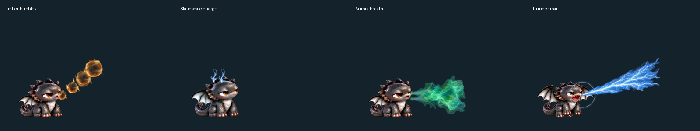
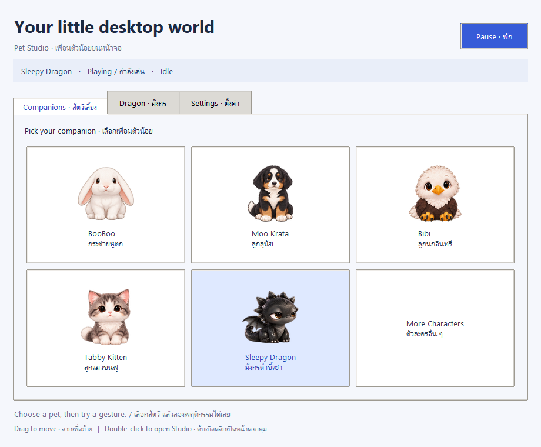

# Cute Desktop Pet (สัตว์เลี้ยงบนหน้าจอคอมพิวเตอร์)

A lovely companion living right on your desktop! 

---

## 🐾 Characters (สัตว์เลี้ยงที่มีให้เลือก)

| Rabbit (กระต่าย BooBoo) | Puppy (ลูกหมาหมูกระทะ) | Bald Eagle (นกอินทรี Bibi) | Tabby Kitten (ลูกแมวแท็บบี้) |
| :---: | :---: | :---: | :---: |
|  |  |  |  |

| Sleepy Dragon (มังกรดำแสนง่วง) |
| :---: |
|  |

---

---

## 📥 Download (ดาวน์โหลดโปรแกรม)

ดาวน์โหลดเวอร์ชันล่าสุด **v0.13.0** จาก [GitHub Releases](https://github.com/panithan1991/cute-desktop-pet/releases/latest):

| Windows (10 / 11) | macOS (Apple Silicon M1/M2/M3/M4) | macOS (Intel) |
| :---: | :---: | :---: |
| [⬇️ **Download Windows — v0.13.0**](https://github.com/panithan1991/cute-desktop-pet/releases/latest/download/CuteDesktopPet-Windows.zip) | [⬇️ **Download Mac Apple Silicon — v0.13.0**](https://github.com/panithan1991/cute-desktop-pet/releases/latest/download/CuteDesktopPet-macOS-Apple-Silicon.zip) | [⬇️ **Download Mac Intel — v0.13.0**](https://github.com/panithan1991/cute-desktop-pet/releases/latest/download/CuteDesktopPet-macOS-Intel.zip) |

### วิธีเปิดใช้งาน (How to Use)
1. **Windows**: แตกไฟล์ ZIP แล้วดับเบิลคลิกเปิดไฟล์ `.exe` ของตัวละครที่ต้องการเล่น (เช่น `Dragon.exe`, `BooBoo.exe`, `MooKrata.exe`, `Bibi.exe`, `Kitten.exe`)
2. **macOS**: แตกไฟล์ ZIP แล้วเปิด `BooBoo.app` (หากระบบขึ้นเตือนความปลอดภัยเนื่องจากไม่ได้ผ่าน Notarize ให้ไปที่ **System Settings → Privacy & Security → Open Anyway**)

### การควบคุม (Controls)
- **คลิกซ้ายค้างแล้วลาก (Left Click & Drag)**: ย้ายตำแหน่งสัตว์เลี้ยงไปวางที่ไหนก็ได้บนหน้าจอ
- **ดับเบิลคลิกที่ตัวสัตว์เลี้ยง (Double Click)**: เปิดหน้าต่าง **Pet Studio**
- **คลิกขวา (Right Click / Control-Click บน Mac)**: เปิดเมนูลัด (สลับตัวละคร, สั่งท่าทาง, สั่งบิน/กระโดด, พักผ่อน, หรือปิดแอป)

