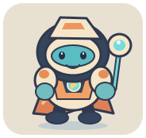
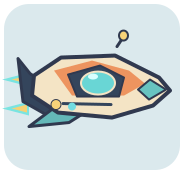
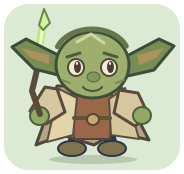
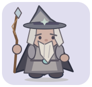
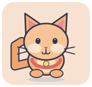

# Cute Desktop Pet 🐾

แอปตัวการ์ตูนตัวเล็กสำหรับ Windows ที่เดินเล่นบนหน้าจอระหว่างทำงาน มีผู้พิทักษ์ดวงดาว ยานสำรวจ ตัวละครผจญภัย 4 แบบ แมว และกระต่ายให้เลือก วาดด้วย Tkinter ทั้งหมด จึงไม่ต้องดาวน์โหลดรูปหรือเปิดเซิร์ฟเวอร์ และไม่มีค่าใช้จ่ายรายเดือน

ผู้พิทักษ์และยานเป็นตัวละครต้นฉบับของโปรเจกต์ ใช้บรรยากาศผจญภัยในอวกาศโดยไม่ใช้ชื่อ โลโก้ เครื่องแต่งกาย หรือรูปทรงยานจากแฟรนไชส์ภาพยนตร์

ผู้ดูแลพฤกษา นักอ่านแผนที่ดาว นักสำรวจเส้นทาง และผู้พิทักษ์แสงอำพันเป็นตัวละครที่วาดขึ้นใหม่สำหรับแอป ใช้ภาพอ้างอิงเพื่อกำหนดแนวแฟนตาซี แต่ปรับรูปทรง สี และอุปกรณ์ให้มีเอกลักษณ์ของตัวเอง

## ตัวละครทั้งหมด

| | |
|:---:|:---:|
|  **ผู้พิทักษ์ดวงดาว** |  **ยานสำรวจดาว** |
|  **ผู้ดูแลพฤกษา** |  **นักอ่านแผนที่ดาว** |
|  **นักสำรวจเส้นทาง** |  **ผู้พิทักษ์แสงอำพัน** |
|  **แมวน้อย** |  **กระต่าย** |

## เริ่มใช้งาน

ต้องมี Windows 10/11 และ Python 3.10 ขึ้นไปพร้อม Tkinter (เลือกติดตั้ง Python รุ่นปกติจาก python.org) ไฟล์ `run.bat` จะเลือก Python ที่เปิด Tkinter ได้เอง หากในเครื่องมี Python หลายตัว

1. ดาวน์โหลด repository นี้เป็น ZIP แล้วแตกไฟล์ หรือใช้ `git clone`
2. ดับเบิลคลิก `run.bat`

## วิธีเล่น

- **ผู้พิทักษ์ดวงดาว** และ **ตัวละครผจญภัยทั้ง 4 แบบ** เดินซ้าย–ขวาและกระโดดขึ้น–ลงเองเป็นช่วง ๆ กดปุ่มกลางที่ตัวละครหรือเลือก **กระโดด** ในเมนูคลิกขวาเพื่อสั่งกระโดดทันที
- **ยานสำรวจดาว** บินทั้งแนวนอนและแนวตั้ง เด้งกลับเมื่อชนขอบพื้นที่หน้าจอ
- แมวและกระต่ายยังเดิน หยุดพัก กะพริบตา และกลับตัวเมื่อถึงขอบจอ
- **ลากด้วยปุ่มซ้าย** เพื่อย้ายตำแหน่ง ตัวละครจะเดินหรือบินต่อจากจุดที่วาง
- **ดับเบิลคลิก** เพื่อหยุดหรือเดินต่อ
- **คลิกขวา** เพื่อเปลี่ยนตัวละคร ความเร็ว หยุดการเคลื่อนที่ ย้ายกลับขอบล่าง หรือออกจากแอป
- พื้นที่ว่างรอบตัวการ์ตูนโปร่งใส จึงไม่บังหน้าต่างที่กำลังทำงานอยู่

แอปจะอยู่เหนือหน้าต่างอื่นตามค่าเริ่มต้น ปิดการตั้งค่านี้ได้จากเมนูคลิกขวา หากต้องการปิดแอปให้เลือก **ออกจากแอป** ในเมนูนั้น

