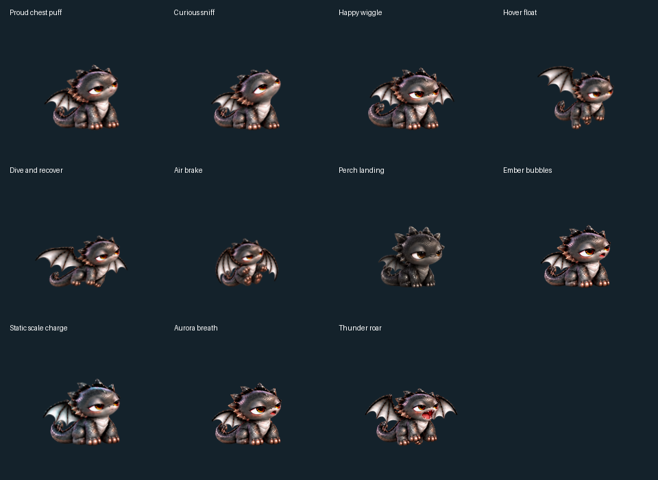
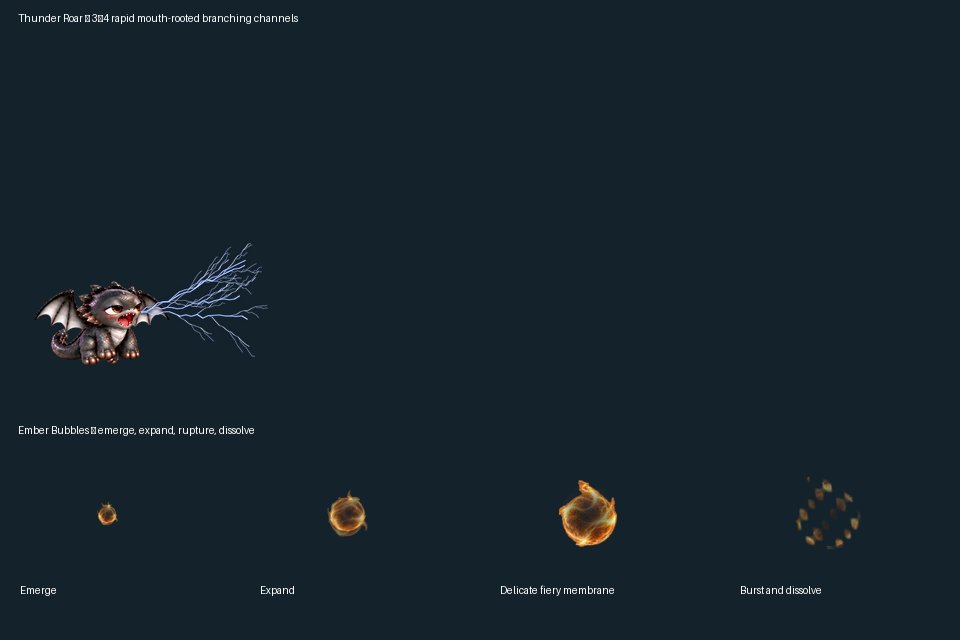

# Cute Desktop Pet

A rabbit, a puppy, a bald eagle, and a fluffy tabby kitten live on your desktop. Each has 195 animation frames, long walks and naps, and its own grooming, sniffing, stretching or playful gestures. Ground pets occasionally run; the eagle flies across and up the screen before landing. Seven other characters are available from the menu.

Named behaviors, recent activity memory, and cooldowns vary the routine. Painted waking, stretching, and turning clips connect rest and travel. Pause and dragging freeze the behavior clock.

| Rabbit | Puppy | Bald Eagle | Tabby Kitten |
| :---: | :---: | :---: | :---: |
|  |  |  |  |

| Sleepy Dragon |
| :---: |
|  |

Eleven new gestures add proud chest puffs, curious sniffing, happy wiggles, hover float, dive and recover, air braking, clinging to the left, right or top screen edge, ember bubbles, static scale charge, aurora breath, and thunder roar. Each has 40 body frames, shared posture joins, and cooldowns. Charging leads into lightning; successful powers can end with a proud or happy reaction. The dragon grips a side or top edge only after flying into it. It performs one random fire, jade gas or mouth-lightning action, then releases its grip and flies down to land. Mouth lightning uses three or four separate branching channels and rapid flashes. Another 66 pre-baked frames connect wingbeats, gripping and landing; aurora breath uses a stable mouth nozzle with 64 smooth flow frames. Pet Studio adds portrait cards, grouped actions, bilingual controls, and a compact context menu.

## Download

Download **v0.12.3** from the [latest release](https://github.com/panithan1991/cute-desktop-pet/releases/latest):

| Download for Window | Download for MAC |
| --- | --- |
| [Download Windows — v0.12.3](https://github.com/panithan1991/cute-desktop-pet/releases/latest/download/CuteDesktopPet-Windows.zip) | [Download Mac Apple Silicon — v0.12.3](https://github.com/panithan1991/cute-desktop-pet/releases/latest/download/CuteDesktopPet-macOS-Apple-Silicon.zip) · [Download Mac Intel — v0.12.3](https://github.com/panithan1991/cute-desktop-pet/releases/latest/download/CuteDesktopPet-macOS-Intel.zip) |

Extract the ZIP. On Windows, open one of the included pet executables. On Mac, open the included app and choose a character from the pet menu. The downloads include Python, Tk, and the artwork. Double-click the pet to open **Pet Studio**, or right-click (Control-click on Mac) and choose **Pet Studio**. Pick a companion from portrait cards, choose dragon gestures by category, and adjust speed or pause. English and Thai labels appear together. Drag the pet to move it.

In Pet Studio, open **Dragon** to try **Walk / Run**, **Jade Cloud Ignition**, flame breath, smoke rings, warning displays, roars, horn lightning, a wing whirlwind, six belly-up smoke rings over a relaxed 36–42 seconds, or fury. The dragon also selects these activities automatically with cooldowns.

Every release ZIP has a [SHA-256 checksum](https://github.com/panithan1991/cute-desktop-pet/releases/latest/download/SHA256SUMS.txt) and a GitHub build attestation. Compare `Get-FileHash FILE.zip -Algorithm SHA256` (Windows) or `shasum -a 256 FILE.zip` (Mac) with the checksum file. To confirm the build came from this repository, run `gh attestation verify FILE.zip -R panithan1991/cute-desktop-pet` with the [GitHub CLI](https://cli.github.com/).

These checks do not replace OS publisher verification. Windows may warn about the unsigned executables. The Mac app is not Apple-notarized; if macOS blocks its first launch, open **System Settings → Privacy & Security → Open Anyway**. If it still does not appear, check the app startup log under `~/Library/Logs/`.

## Run from source

Install Python 3.10+ with Tkinter, then run `run.bat` on Windows or `run.command` on Mac. No third-party Python packages are needed at runtime.

To build the downloadable apps, install `pyinstaller==6.22.3` and `Pillow>=10,<13`, then run `scripts/build_windows.bat` on Windows or `sh scripts/build_macos.sh` on Mac. Run `python -m unittest discover -s tests -q` to check the code and sprite atlases.
