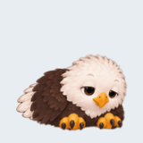
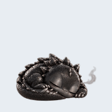
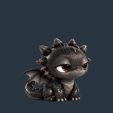

# Cute Desktop Pet

A rabbit, a puppy, a bald eagle, and a fluffy tabby kitten live on your desktop. Each has 195 animation frames, long walks and naps, and its own grooming, sniffing, stretching or playful gestures. Ground pets occasionally run; the eagle flies across and up the screen before landing. Seven other characters are available from the menu.

The sleepy black dragon has 240 frames, including tail hugs, smoky hiccups, and a wing blanket. Smoke rings and tiny flames form, drift or shrink, then fade inside the pet window.

Named behaviors, recent activity memory, and cooldowns vary the routine. Painted waking, stretching, and turning clips connect rest and travel. Pause and dragging freeze the behavior clock.

| Rabbit | Puppy | Bald Eagle | Tabby Kitten |
| :---: | :---: | :---: | :---: |
|  |  |  |  |

 

## Download

Choose a ZIP from the [latest release](https://github.com/panithan1991/cute-desktop-pet/releases/latest):

| Download for Window | Download for MAC |
| --- | --- |
| [Windows 10/11 ZIP](https://github.com/panithan1991/cute-desktop-pet/releases/latest/download/CuteDesktopPet-Windows.zip) | [Apple Silicon ZIP](https://github.com/panithan1991/cute-desktop-pet/releases/latest/download/CuteDesktopPet-macOS-Apple-Silicon.zip) · [Intel ZIP](https://github.com/panithan1991/cute-desktop-pet/releases/latest/download/CuteDesktopPet-macOS-Intel.zip) |

Extract the ZIP. On Windows, open one of the included pet executables. On Mac, open the included app and choose a character from the pet menu. The downloads include Python, Tk, and the artwork. Right-click the pet (or Control-click on Mac) to switch characters, trigger a playful roll, pause, or quit. Drag it to move it.

Every release ZIP has a [SHA-256 checksum](https://github.com/panithan1991/cute-desktop-pet/releases/latest/download/SHA256SUMS.txt) and a GitHub build attestation. Compare `Get-FileHash FILE.zip -Algorithm SHA256` (Windows) or `shasum -a 256 FILE.zip` (Mac) with the checksum file. To confirm the build came from this repository, run `gh attestation verify FILE.zip -R panithan1991/cute-desktop-pet` with the [GitHub CLI](https://cli.github.com/).

These checks do not replace OS publisher verification. Windows may warn about the unsigned executables. The Mac app is not Apple-notarized; if macOS blocks its first launch, open **System Settings → Privacy & Security → Open Anyway**. If it still does not appear, check the app startup log under `~/Library/Logs/`.

## Run from source

Install Python 3.10+ with Tkinter, then run `run.bat` on Windows or `run.command` on Mac. No third-party Python packages are needed at runtime.

To build the downloadable apps, install `pyinstaller==6.22.3` and `Pillow>=10,<13`, then run `scripts/build_windows.bat` on Windows or `sh scripts/build_macos.sh` on Mac. Run `python -m unittest discover -s tests -q` to check the code and sprite atlases.
